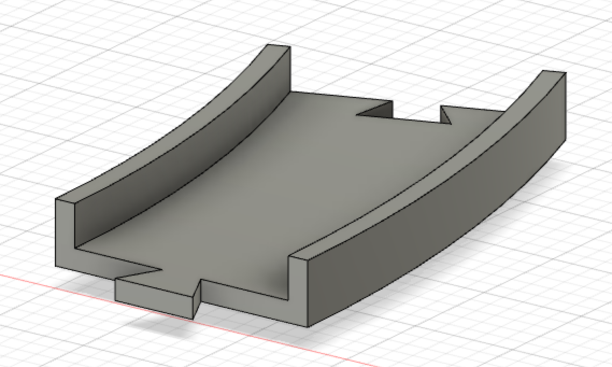

# Truck-README

CONTENTS OF THIS FILE
---------------------

 * INTRODUCTION
 * MATERIALS/APPLICATIONS/APPLIANCES
 * 3D PRINTING INSTRUCTIONS
 * 3D PIECES
 * COMPLETE CODE
 * DOWNLOADS AVAILABLE
 
INTRODUCTION
------------

The JEM Truck&Track is exactly what it sounds like. A 3D designed and printed truck, track, and car wash. Everything was coded using PowerShell and a RaspberryPi. The majority of our project is 3d printed, with one multi-media aspect. The multi-media aspect is a few thin ribbons. The ribbons act as the part of the car wash that washes the car, powered by a Servo motor.

Our Planning:

MATERIALS/APPLICATIONS/APPLIANCES
------------

 1 Servo Motor 

 1 D.C Motor 

 1 Raspberry Pi 

 2 9V Batteries 

 1 3D Printer 

 A form of adhesive (e.g. Hot glue gun, tape) 

 Python 

 Windows PowerShell 

 1m Thin ribbon 

3D PRINTING INSTRUCTIONS
------------

TRACK: 18 pieces needed. Pieces slide fit together to form a circular track. A cheaper alternative is to use 9 pieces to form a semicircle.

WHEEL: 4 pieces needed. 2 pieces move the truck by connecting to the D.C Motor and the remaining 2 support the truck's rear.

CONNECTOR: 1 piece needed. Connects the 2 wheels at the truck's rear.

TRUCK: 1 piece needed. Contains the Raspberry Pi, batteries and D.C Motor and moves along the track.

CAR WASH: 1 piece needed. An archway for the truck to move through along the track.

CAR WASH ROOF BRUSH: 1 piece needed. Connects to the Servo Motor and sits above the car wash, rotating to brush the top of the truck.

3D PIECES
------------
Track piece:

Wheel on track:

Wheels with connector:

COMPLETE CODE
------------

- Truck: -

import explorerhat as eh
import time
print('Time to make your truck move')

 eh.motor.one.forward(100) 

 time.sleep(3) 

 eh.motor.one.backward(80) 

 time.sleep(3) 

 eh.motor.one.forward(50) 

 time.sleep(3) 

 eh.motor.one.backward(65) 

 time.sleep(3) 

 eh.motor.one.forward(100) 

 time.sleep(3) 

 eh.motor.one.backward(80) 

 time.sleep(3) 

 eh.motor.one.forward(50) 

 time.sleep(3) 

 eh.motor.one.backward(65) 

 time.sleep(3) 

 eh.motor.one.forward(100) 

 time.sleep(3) 

 eh.motor.one.stop() 

- Car Wash: -

import RPi.GPIO as GPIO
import time

servoPIN = 18
GPIO.setmode(GPIO.BCM)
GPIO.setup(servoPIN, GPIO.OUT)

p = GPIO.PWM(servoPIN, 50)
p.start(2.0)
p.ChangeDutyCycle(0)

try:
        while True:
                angle = float(input('Start your carwash:'))
                duty = (2.0 + angle/18)
                p.ChangeDutyCycle(duty)
                time.sleep(0.25)
                p.ChangeDutyCycle(0)
except KeyboardInterrupt:
        p.stop()
        GPIO.cleanup()

Downloads Available
------------
- Truck Body [Body for the Truck]
- Truck Wheel (Print 4) [The Wheels]
- Connector [To Connect The Back Wheels]
- Car Wash Body [Main Frame of The Car Wash]
- Car Wash Rod [Rod That Connects The Car Wash to The Servo Motor]
- Track [The Road For The Truck]
